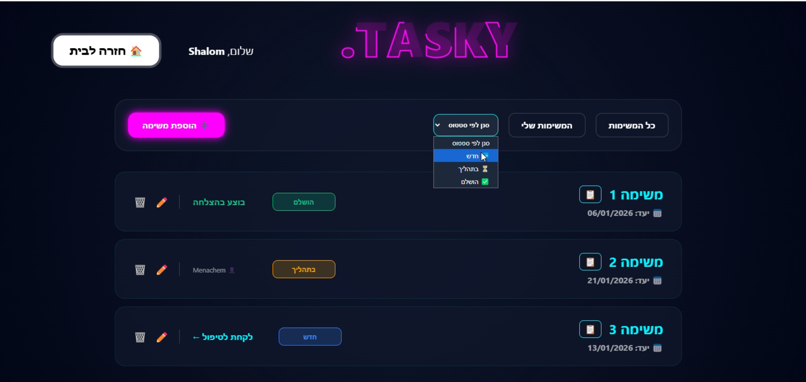
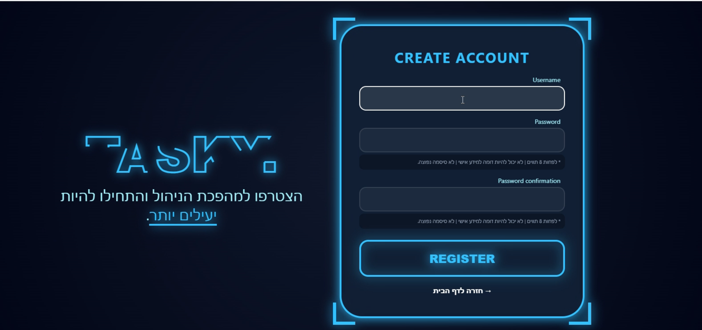
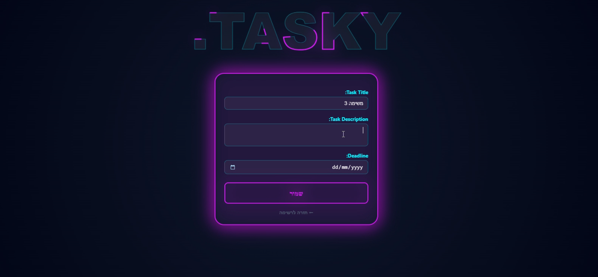

<div align="center">

#  Tasky — מערכת ניהול משימות לצוותים

**אפליקציית Full-Stack לניהול משימות בצוות, בנויה עם Django 5.2**


</div>

---

## על הפרויקט

**Tasky** היא פלטפורמת שיתוף פעולה לצוותים המאפשרת לארגונים לנהל משימות עם **בקרת גישה מבוססת תפקידים (RBAC)**. המערכת מבדילה בין **מנהלים** שיוצרים ומפקחים על משימות, לבין **חברי צוות** שתופסים ומסיימים אותן — הכול בתוך ממשק מעוצב בסגנון סייברפאנק עם תמיכה מלאה בעברית (RTL).

> פרויקט Django מקצה לקצה הכולל: אימות משתמשים, הרשאות, מודלינג נתונים רלציוני ורינדור דינמי בצד השרת.

---

## Screenshots

**לוח משימות**


**הרשמה**


**יצירת משימה**


---

##  תכונות עיקריות

###  אימות והרשאות
- הרשמת משתמשים עם ולידציה מובנית של סיסמאות
- ניהול סשן: התחברות / התנתקות
- **בקרת גישה לפי תפקיד (RBAC)** — הרשאות מנהל מול משתמש רגיל, נאכפות ברמת ה-View
- הגנה עם `@login_required` על כל הנתיבים הרגישים

### ניהול מחזור חיי משימה
- **CRUD מלא** על משימות — יצירה, קריאה, עריכה, מחיקה
- מערכת סטטוס בת שלושה שלבים:
  - **חדשה** — פנויה לתפיסה
  - **בטיפול** — משויכת לחבר צוות
  - **הושלמה** — נעולה לשינויים
- מנהלים יוצרים ועורכים משימות (רק כשהן לא משויכות)
- חברי צוות תופסים משימות ומסמנים אותן כהושלמות
- לוגיקת עסק נאכפת בצד השרת — מעברי סטטוס מוגנים ב-Views

### שיתוף פעולה בצוות
- תמיכה במספר צוותים עם נראות משימות מסוננת לפי צוות
- לכל צוות מנהל אחד ומספר חברים
- הגדרת פרופיל דינמי — בחירת תפקיד וצוות לאחר הרשמה

### סינון וניווט
- סינון משימות לפי סטטוס (חדשה / בטיפול / הושלמה)
- תצוגת "המשימות שלי" למעקב אישי
- חלונות popup לפרטים מלאים של משימה

### עיצוב וחווית משתמש
- עיצוב סייברפאנק עם אפקטי זוהר מונפשים
- **עיצוב רספונסיבי** מלא למובייל (מתחת ל-1300px)
- **פריסת RTL** עם תמיכה מלאה בעברית
- אנימציות CSS3, גרדיאנט טקסט ואפקטי ניאון — ללא ספריות UI חיצוניות

---

## טכנולוגיות

| שכבה | טכנולוגיה |
|---|---|
| **Framework Backend** | Django 5.2.6 |
| **שפת תכנות** | Python 3.10+ |
| **מסד נתונים** | SQLite3 (דרך Django ORM) |
| **Frontend** | HTML5, CSS3, Vanilla JavaScript |
| **עיצוב** | אנימציות CSS3 מותאמות + Tailwind CSS |
| **אימות משתמשים** | מערכת האימות המובנית של Django |
| **פריסה** | תמיכה ב-WSGI / ASGI |

---

## 🗄️ מודל הנתונים

```
User (מובנה ב-Django)
 └── UserStaff (OneToOne)
      ├── role: IntegerField (1=מנהל, 2=משתמש)
      └── team: ForeignKey → Team

Team
 ├── name: CharField
 └── manager: ForeignKey → UserStaff

Task
 ├── title: CharField
 ├── description: TextField
 ├── dateEnd: DateField
 ├── status: IntegerField (1=חדשה, 2=בטיפול, 3=הושלמה)
 ├── user: ForeignKey → UserStaff (nullable — לא משויך)
 └── team: ForeignKey → Team
```

**קשרים:** User ↔ UserStaff (1:1) · UserStaff ↔ Team (M:1) · Task ↔ Team (M:1) · Task ↔ UserStaff (M:1, אופציונלי)

---

## מבנה הפרויקט

```
Project-Python/
├── DjangoProject/          # קונפיגורציית הפרויקט
│   ├── settings.py         # הגדרות ומסד נתונים
│   ├── urls.py             # נתב URL ראשי
│   ├── wsgi.py             # WSGI gateway
│   └── asgi.py             # ASGI gateway
│
├── DjangoApp/              # האפליקציה המרכזית
│   ├── models.py           # מודלים: UserStaff, Team, Task
│   ├── views.py            # 9 פונקציות View
│   ├── urls.py             # ניתוב URL ברמת האפליקציה
│   ├── forms.py            # Django ModelForms
│   ├── admin.py            # הגדרת פאנל אדמין
│   ├── migrations/         # היסטוריית migrations
│   └── templates/          # 6 תבניות HTML
│       ├── home.html           # דף בית
│       ├── allTasks.html       # לוח המשימות
│       ├── taskForm.html       # טופס יצירה/עריכה
│       ├── login.html          # כניסה
│       ├── register.html       # הרשמה
│       └── profile.html        # פרופיל משתמש
│
├── static/                 # קבצים סטטיים
├── db.sqlite3              # מסד הנתונים
├── manage.py               # Django CLI
├── tailwind.config.js      # קונפיגורציית Tailwind
└── package.json            # תלויות Node
```

---

## נתיבי URL

| נתיב | מתודה | הרשאה | תיאור |
|---|---|---|---|
| `/` | GET | פומבי | דף בית |
| `/register/` | GET, POST | פומבי | הרשמת משתמש |
| `/login/` | GET, POST | פומבי | כניסה |
| `/logout/` | GET | מחובר | התנתקות |
| `/profile/` | GET, POST | מחובר | הגדרת תפקיד וצוות |
| `/allTasks/` | GET | מחובר | לוח משימות |
| `/tasks/add/` | GET, POST | מנהל בלבד | יצירת משימה |
| `/tasks/edit/<id>/` | GET, POST | מנהל בלבד | עריכת משימה |
| `/tasks/delete/<id>/` | GET | מנהל בלבד | מחיקת משימה |
| `/tasks/take/<id>/` | GET | מחובר | תפיסת משימה |
| `/tasks/complete/<id>/` | GET | בעל המשימה | סיום משימה |
| `/admin/` | — | Superuser | פאנל אדמין |

---

## התקנה והרצה

```bash
# 1. שיבוט הריפוזיטורי
git clone https://github.com/sari1108/Project-Python.git
cd Project-Python

# 2. יצירת סביבה וירטואלית והפעלתה
python -m venv venv
venv\Scripts\activate        # Windows
source venv/bin/activate     # macOS/Linux

# 3. התקנת תלויות
pip install django

# 4. הרצת migrations
python manage.py migrate

# 5. יצירת משתמש אדמין (לניהול צוותים)
python manage.py createsuperuser

# 6. הפעלת שרת הפיתוח
python manage.py runserver
```

פתחו את הדפדפן בכתובת [http://127.0.0.1:8000](http://127.0.0.1:8000)

> **הערה:** ליצירת צוותים, היכנסו ל-`/admin/` עם פרטי ה-Superuser והוסיפו צוותים דרך פאנל האדמין של Django.

---

## אבטחה

- CSRF tokens על כל הטפסים
-  הצפנת סיסמאות עם Django's built-in auth
-  הגנה מפני SQL Injection דרך Django ORM
-אימות הרשאות לפי תפקיד ברמת ה-View
-  `@login_required` על כל הנתיבים המוגנים
- ולידציה של מעברי סטטוס בצד השרת

---

## מיומנויות שמודגמות בפרויקט

- **פיתוח Full-Stack** עם Python ו-Django
- **תכנון מסד נתונים רלציוני** — מודלים עם קשרי Foreign Key
- **אימות משתמשים ו-RBAC** — פרופיל מותאם עם הרשאות לפי תפקיד
- **Django ORM** — שאילתות מורכבות, Cascading deletes, Foreign Key אופציונלי
- **ולידציה של טפסים** — ModelForms, UserCreationForm, לוגיקת עסק
- **מנוע תבניות Django** — Context, תנאים, לולאות
- **עיצוב רספונסיבי** — אנימציות CSS3, תמיכת RTL, פריסת מובייל
- **ארכיטקטורת תוכנה** — MTV Pattern, URL Routing, Decorator Middleware
- **Git** — ניהול גרסאות וזרימת עבודה

---

## מפתחת

**Sari** · [github.com/sari1108](https://github.com/sari1108)

---

<div align="center">

*נבנה עם Django 5.2 · Python 3.10+ · SQLite3*

</div>
